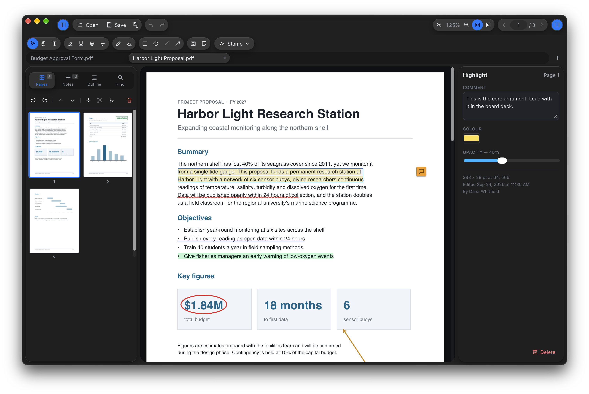
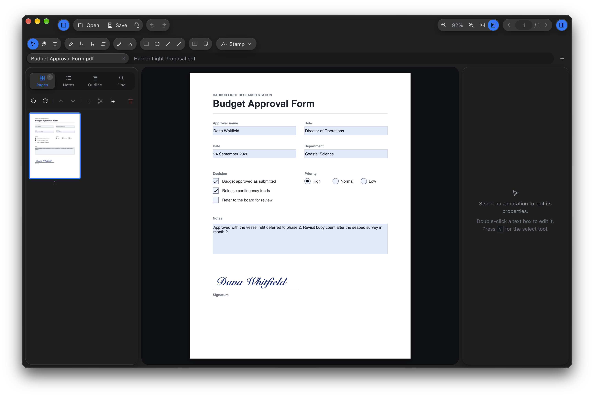
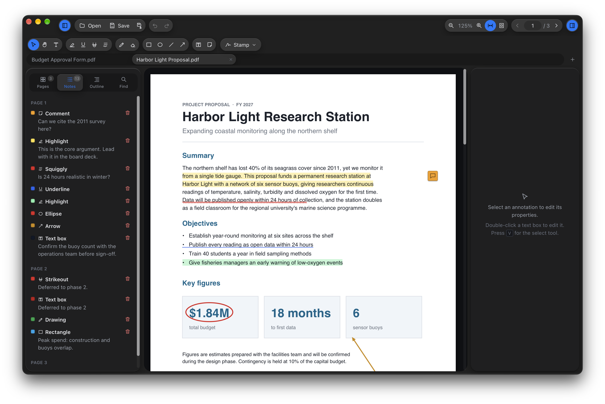

# VrushPDF

A small, fast PDF reader and annotator for Mac, Windows and Linux. Mark up, fill in, sign and rearrange PDFs, with no account, no subscription and no cloud.

**[Download the latest version](https://github.com/nashv/VrushPDF/releases/latest)** · 14-day free trial, then a one-time license

## What it does

- **Annotate:** highlight, underline, strikeout and squiggly on text; pen and eraser; rectangles, ellipses, lines and arrows; text boxes; comments; image stamps; APPROVED / REVIEWED / DRAFT / CONFIDENTIAL / FINAL stamps. Colour, opacity and stroke width for each, and undo/redo for everything.
- **Sign:** draw a signature once and reuse it.
- **Fill in forms:** text fields, checkboxes, radio buttons, dropdowns and list boxes.
- **Pages:** reorder by dragging thumbnails, rotate, delete, insert blank pages, insert another PDF, or merge several PDFs.
- **Read:** tabs, continuous scroll, whole-document search, bookmarks, thumbnails.
- **Nothing is flattened.** Annotations are saved as standard PDF annotations, so they stay editable in Preview, Acrobat and Chrome.
- **Private:** no account, no telemetry. The app never goes online, and the license check happens offline.

| | |
|---|---|
|  |  |

## Install

Get the installer for your system from the [latest release](https://github.com/nashv/VrushPDF/releases/latest).

| System | File |
|---|---|
| Mac with Apple Silicon (M1 and later) | `VrushPDF_<version>_aarch64.dmg` |
| Mac with Intel | `VrushPDF_<version>_x64.dmg` |
| Windows 10 and 11 | `VrushPDF_<version>_x64-setup.exe` (or the `.msi`) |
| Linux | `.deb`, `.rpm` or `.AppImage` |

**First launch.** The installers aren't signed by Apple or Microsoft yet, so the first time you open VrushPDF:

- **macOS:** after the warning, open **System Settings ▸ Privacy & Security**, scroll down and click **Open Anyway** next to VrushPDF. You only need to do this once.
- **Windows:** if SmartScreen appears, click **More info ▸ Run anyway**.

## Trial and license

Every feature works for 14 days. After that, PDFs still open and read for free, but saving and editing need a license. It's a one-time purchase, and your key works on up to three of your own computers. To enter it, choose **Enter License…** in the VrushPDF menu (the Help menu on Windows and Linux).

## Feedback

Found a bug or missing something? [Open an issue](https://github.com/nashv/VrushPDF/issues).

---

This repository holds releases only; the source is closed.
