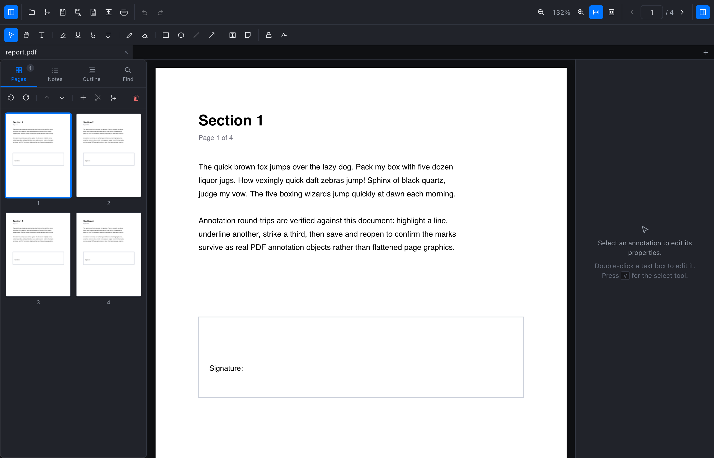
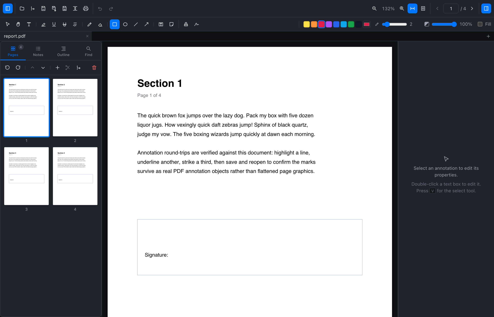
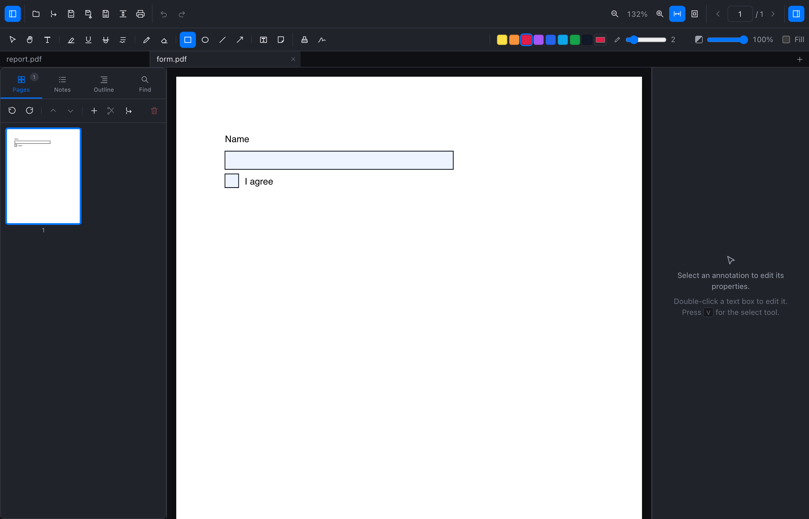

# VrushPDF

<p align="center">
  <strong>A blazingly fast, lightweight, and privacy-first desktop PDF editor & viewer.</strong>
  <br />
  <em>Native look and feel on macOS, Windows, and Linux. Zero bloat. 100% offline.</em>
</p>

<p align="center">
  <a href="https://github.com/nashv/VrushPDF/releases/latest"></a>
  
  
  
  
</p>

<p align="center">
  
</p>

---

## 📸 Interface & Feature Showcase

<div align="center">

<table>
  <tr>
    <td align="center" width="50%">
      <a href="docs/screenshots/01-editor-overview.png"></a>
      <br />
      <b>📖 Document Viewer & Multi-Tab Workspace</b>
      <p><em>Continuous virtualized scrolling, drag-and-drop thumbnail sidebar, whole-document search</em></p>
    </td>
    <td align="center" width="50%">
      <a href="docs/screenshots/02-markup-studio.png"></a>
      <br />
      <b>✍️ Annotation & Markup Studio</b>
      <p><em>Real text highlight, smooth pen, geometric shapes, sticky notes & live properties inspector</em></p>
    </td>
  </tr>
  <tr>
    <td align="center" width="50%">
      <a href="docs/screenshots/03-forms-and-signatures.png"></a>
      <br />
      <b>🖋️ Interactive Forms & Signatures</b>
      <p><em>Fill text fields, checkboxes, dropdowns, and place reusable drawn signatures and stamps</em></p>
    </td>
    <td align="center" width="50%">
      <a href="docs/screenshots/04-pdf-optimizer.png"></a>
      <br />
      <b>🗜️ PDF Optimizer & Compression</b>
      <p><em>SIMD image downsampling (72–300 DPI), stream cleanup, standard font unembedding</em></p>
    </td>
  </tr>
  <tr>
    <td align="center" colspan="2">
      <a href="docs/screenshots/05-dark-mode-liquidglass.png"></a>
      <br />
      <b>🌙 Dark Mode & Cross-Platform Native Theming</b>
      <p><em>Tailored design systems: macOS LiquidGlass, Windows Fluent, GNOME Adwaita & KDE Breeze</em></p>
    </td>
  </tr>
</table>

</div>

---

## 🚀 Why VrushPDF?

Most modern PDF editors are either slow, cloud-tethered Electron apps that chew through gigabytes of RAM, or expensive software charging recurring monthly subscriptions. 

**VrushPDF** is engineered from the ground up to be different:

- **⚡ Blazing Native Performance**: Built on **Tauri 2**, **Rust**, and **Svelte 5**. Instant startup, smooth 60+ FPS scrolling, and minimal memory usage.
- **🛡️ True Non-Destructive Interoperability**: Annotations are written as **standard PDF annotation objects** with real appearance streams (`/Annots`). Your highlights, notes, and drawings stay fully editable in VrushPDF *and* industry-standard viewers like Apple Preview, Adobe Acrobat, and Google Chrome — nothing is flattened or rasterized into background graphics unless you choose to.
- **🎨 Native on Every Desktop**: Features tailored platform styling — **LiquidGlass** on macOS, **Fluent Design System 2** on Windows, **Adwaita / Libadwaita** on GNOME, and **Breeze** on KDE Plasma.
- **🔒 100% Private & Fully Offline**: Your sensitive documents never leave your machine. No telemetry, no background network calls, no cloud tracking.
- **💰 Fair, Transparent Pricing**: No recurring subscriptions. A 14-day fully featured free trial followed by a single, affordable one-time purchase.

---

## ✨ Features at a Glance

### 📖 Document Viewing & Navigation
- **Multi-Document Tabs**: Work with multiple PDFs side-by-side with independent zoom, scroll positions, and undo histories.
- **Continuous Virtualized Scrolling**: Smooth, responsive page rendering with fit-width, fit-page, and granular stepped zoom.
- **Whole-Document Search**: High-performance text search with exact 2D affine matrix highlight positioning across rotated pages and vertical text runs.
- **Sidebar & Outlines**: Interactive thumbnail grid with drag-and-drop page reordering, table of contents bookmark navigation, and resizable split views.
- **Password-Protected PDFs**: Seamless decryption on open and automatic, secure **AES-128 re-encryption** upon saving.

### ✍️ Professional Annotation & Markup Studio
- **Text Markup**: Real text-selection Highlight, Underline, Strikeout, and Squiggly tools.
- **Drawing & Shapes**: Freehand Pen with smooth stroke rendering, Eraser, Rectangle, Ellipse, Line, and Arrow vector primitives.
- **Text Boxes & Sticky Notes**: Rich text annotations and expandable comment pins with author notes.
- **Full Style Customization**: Live palette picker, custom hex colors, opacity controls, line thickness, and stroke styling.
- **Deep Undo/Redo**: Snapshot-based undo and redo history across all annotations and page modifications.

### 🖋️ Signatures & Stamps
- **Reusable Signatures**: Draw, save, and manage reusable vector signatures with quick one-click placement.
- **Standard Dynamic Stamps**: Pre-configured stamps including *APPROVED*, *REVIEWED*, *DRAFT*, *CONFIDENTIAL*, and *FINAL*.
- **Custom Image Stamps**: Import raster stamps (PNG, JPEG) with embedded metadata for complete round-trip editability.

### 📝 Form Filling
- **Interactive PDF Forms**: Fill text fields, toggle checkboxes, select radio buttons, and choose from dropdowns and list boxes.
- **Standard Compliance**: Form entries generate standard appearance streams saved directly into the PDF, rendering identically across Adobe Acrobat, Chrome, and Apple Preview.

### 📄 Page Operations & Document Assembly
- **Visual Thumbnail Reordering**: Reorder pages instantly by dragging thumbnails.
- **Insert, Rotate & Delete**: Insert blank pages, rotate selected pages clockwise or counter-clockwise, or prune unwanted pages.
- **PDF Merging**: Combine and append external PDF files into your active document with automatic outline tree remapping.

### 🗜️ PDF Optimizer & Compression (Adobe Acrobat Parity)
- **High-Performance Image Downsampling**: SIMD-accelerated Lanczos3 resampling reducing image payloads by up to 80% with customizable DPI thresholds (72, 150, 225, 300 DPI) and JPEG quality tuning.
- **Object & Stream Flattening**: Prune unreferenced objects, strip bloated metadata trees, discard embedded thumbnails, and unembed standard 14 font streams.
- **PDF 1.5+ Object Streams**: Maximize dictionary compaction with `/ObjStm` compression.
- **One-Click Presets**: Quick profiles for *Standard Balanced*, *Mobile / Web*, *High-Quality Print*, and *Clean & Compact*.

### 🔒 Document Security & Flattened Export
- **Flattened PDF Saving (`⌥⌘S` / `Alt+Shift+S`)**: Burn annotations, signatures, and form fields directly into base page content streams to prevent extraction or tampering.
- **Signature Security Prompts**: Automatic safety alerts when saving signed documents unflattened, with a persistent settings toggle.

### 🖨️ Native Vector Printing
- **Direct Native Print Pipeline (`⌘P` / `Ctrl+P`)**: Renders full-resolution vector pages with all active annotations, form values, and rotations directly through native operating system print dialogs (AppKit/PDFKit on macOS, ShellExecute on Windows, GTKLP/CUPS on Linux).

---

## 💎 Pricing & Licensing

VrushPDF believes in software ownership, not perpetual rental.

| Plan | Price | Details |
| :--- | :--- | :--- |
| **14-Day Free Trial** | **Free ($0)** | All features unlocked from day one. No credit card required. No account creation. |
| **Personal Lifetime License** | **One-Time Purchase** | Lifetime access, all future updates, offline cryptographic Ed25519 activation. Use on all your personal computers. |

- **No Subscription Fatigue**: Pay once, keep it forever.
- **Completely Offline Activation**: License keys (`VRSH....`) are cryptographically verified locally on your machine via Ed25519 asymmetric signatures. The app never phones home or contacts a license server.
- **Get a License**: Purchase securely via [Paddle Checkout](https://vrushpdf.app/buy) and activate inside the app via **VrushPDF ▸ Enter License…** (or **Help ▸ Enter License…** on Windows and Linux).

---

## ⌨️ Essential Keyboard Shortcuts

| Shortcut (macOS) | Shortcut (Win / Linux) | Action |
| :--- | :--- | :--- |
| `⌘T` | `Ctrl+T` | New Tab |
| `⌘W` | `Ctrl+W` | Close Tab |
| `⌘O` | `Ctrl+O` | Open PDF |
| `⌘S` | `Ctrl+S` | Save Changes |
| `⌥⌘S` | `Alt+Shift+S` | Save Flattened PDF |
| `⌥⌘O` | `Alt+Ctrl+O` | Open PDF Optimizer |
| `⌘P` | `Ctrl+P` | Print Document |
| `⌘F` | `Ctrl+F` | Find in Document |
| `⌘Z` / `⇧⌘Z` | `Ctrl+Z` / `Ctrl+Y` | Undo / Redo |
| `⌘\` | `Ctrl+\` | Toggle Thumbnail Sidebar |
| `⌘0` | `Ctrl+0` | Fit Page to Viewport |
| `⌥⌘0` | `Ctrl+Alt+0` | Actual Size (100%) |
| `⇧⌘−` / `⇧⌘=` | `Ctrl+Shift+-` / `Ctrl+Shift+=` | Rotate Page Left / Right |
| `V` / `H` | `V` / `H` | Select Tool / Pan Hand |
| `1` / `2` / `3` / `4` | `1` / `2` / `3` / `4` | Highlight / Underline / Strikeout / Squiggly |
| `P` / `E` | `P` / `E` | Freehand Pen / Eraser |
| `R` / `O` / `L` / `A` | `R` / `O` / `L` / `A` | Rectangle / Ellipse / Line / Arrow |
| `X` / `N` | `X` / `N` | Text Box / Sticky Note |

---

## 📦 Downloads & Installation

Pre-compiled release packages are available on the [**GitHub Releases**](https://github.com/nashv/VrushPDF/releases/latest) page:

| Operating System | Available Packages | Notes |
| :--- | :--- | :--- |
| **macOS** | `.dmg` Installer, `.app` Bundle | Universal / Apple Silicon (`arm64`) & Intel (`x86_64`). Ad-hoc signed. |
| **Windows** | `.msi` (WiX), `-setup.exe` (NSIS) | Windows 10 / 11 (64-bit). |
| **Linux** | `.deb`, `.rpm`, `.AppImage` | Ubuntu/Debian, Fedora/RHEL, and universal AppImage (`x86_64`). |

### Installation Notes (Unsigned Builds)
VrushPDF binaries are currently built without expensive proprietary enterprise developer certificates:
- **macOS**: If Gatekeeper shows *"cannot be opened because the developer cannot be verified"*, simply **Right-Click ▸ Open** the app once, or run `xattr -cr /Applications/VrushPDF.app`.
- **Windows**: If Microsoft Defender SmartScreen appears, click **More info ▸ Run anyway**.
- **Linux**: For AppImages, make executable with `chmod +x VrushPDF*.AppImage` and run.

---

## 🛠️ Developer & Build Guide

### Prerequisites
- [Node.js](https://nodejs.org/) (v18+) & `npm`
- [Rust](https://www.rust-lang.org/) (stable toolchain)
- Platform dependencies (Xcode Command Line Tools on macOS, WebView2 on Windows, WebKitGTK & libsoup on Linux)

### Running Locally
```sh
npm install
npm run tauri dev                              # Start desktop app with hot reload
npm run tauri dev -- -- -- path/to/sample.pdf   # Open a PDF directly on start
```

### Verification & Testing Suite
```sh
npm run check                                     # Svelte and TypeScript type check
npm run verify:roundtrip                          # Headless PDF serialization & persistence tests
npm run verify:ui                                 # Automated UI integration tests in headless Chromium
cargo test --manifest-path src-tauri/Cargo.toml   # Native Rust backend unit tests
cargo test --manifest-path keygen/Cargo.toml      # License keygen cryptographic tests
npm run keygen:check                              # Diagnostic keypair integrity check
```

### Building Release Artifacts
```sh
npm run tauri build                               # Compile production bundle for host OS
```

---

## 📐 Architecture & Layout

```
src/lib/pdf/           pdf.js integration, text layer, affine search, native printing
src/lib/annotations/   annotation model, hit-testing, appearance streams, import/export,
                       outline tree preservation, optimizer engine (optimize.ts)
src/lib/state/         reactive workspace stores, document state, undo history, viewer,
                       session manager, settings, offline license state
src/lib/styles/        platform design tokens (macOS LiquidGlass, Win Fluent, GNOME Adwaita, KDE Breeze)
src/lib/components/    toolbar, sidebar, canvas viewer, overlay, properties inspector, dialogs
                       (OptimizeDialog, MergeDialog, SettingsDialog, SignaturePad)
src-tauri/src/         native filesystem, window backdrop, SIMD image downsampling (optimize.rs),
                       AES-128 re-encryption (encrypt.rs), offline Ed25519 licensing (license.rs)
keygen/                offline key generation CLI and cryptographic verification tool
scripts/               automated verification suites (round-trip, UI smoke tests, fixtures)
```

---

<p align="center">
  <strong>VrushPDF</strong> — Crafting a better, faster, and truly private PDF experience.
</p>
